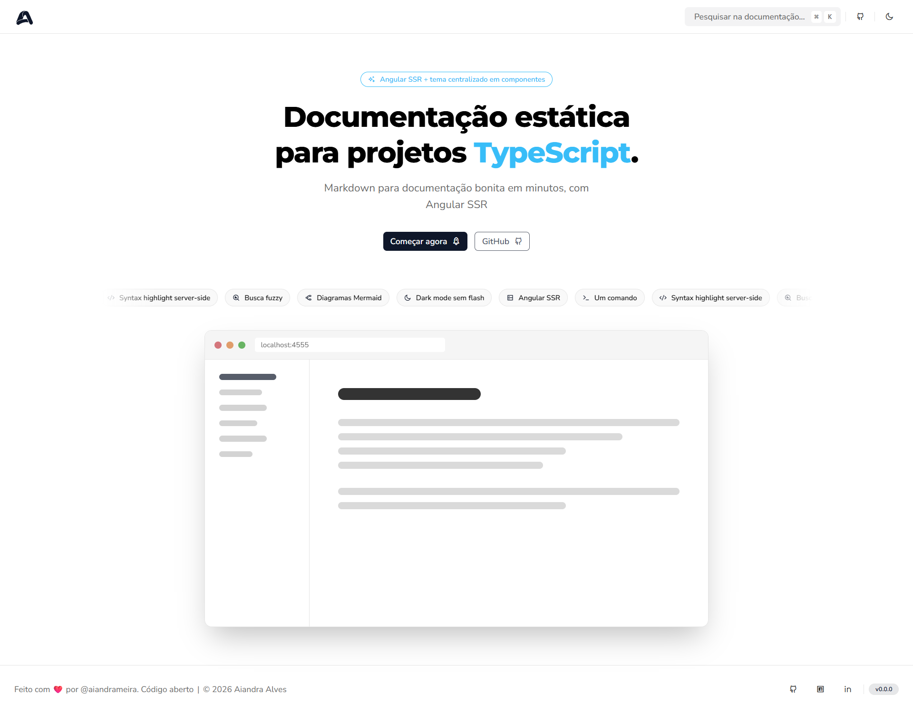

# 📚 @aiandrameira/ai-docs

<p align="center">
    
</p>

<p align="center">
    <strong>AiDocs</strong> existe para tirar o trabalho de montar um site de documentação do seu caminho.<br />
    Escreva Markdown na sua lib ou projeto TypeScript e publique um site pronto — sem montar tema, layout ou infraestrutura.
</p>

<p align="center">
    
    
    
    
</p>

<p align="center">
    
</p>

## 📍 Visão geral

Manter documentação boa dá trabalho: normalmente é preciso escolher um framework de docs, configurar tema, busca, dark mode e deploy — e mesmo assim sobra pouco tempo pra escrever o conteúdo em si. O AiDocs resolve isso com uma ideia simples: você escreve `.md`, ele entrega um site completo pronto pra publicar, em qualquer lugar que sirva arquivos estáticos.

Não é preciso conhecer Angular, configurar SSR ou mexer em build de frontend — isso é implementação interna, invisível pra quem usa o pacote.

- **Zero configuração pra começar** — `ai-docs init` e o site já funciona
- **Busca embutida** — paleta de comandos (⌘K / Ctrl+K) indexando todo o conteúdo, sem servidor de busca
- **Diagramas Mermaid** direto no Markdown, sem plugin extra
- **Dark mode e syntax highlight** prontos por padrão, sem flash e sem JS extra no cliente
- **Saída 100% estática** — HTML puro, publicável em qualquer CDN ou hospedagem

## 🚀 Instalação

O pacote é publicado no GitHub Packages. Configure o registry do escopo `@aiandrameira` em um `.npmrc`:

```ini
@aiandrameira:registry=https://npm.pkg.github.com
//npm.pkg.github.com/:_authToken=SEU_TOKEN_COM_read:packages
```

Instale e inicialize:

```bash
npm install --save-dev @aiandrameira/ai-docs
npx ai-docs init
```

Adicione os scripts ao `package.json`:

```json
{
    "scripts": {
        "docs:dev": "ai-docs dev",
        "docs:build": "ai-docs build"
    }
}
```

Documentação completa: instalação, configuração e guia passo a passo estão em [`docs/`](./docs) (e publicadas no próprio site gerado pelo projeto).

## ✨ Stack

- [Angular 21 (SSR)](https://angular.dev)
- [Nx](https://nx.dev)
- [TailwindCSS 4](https://tailwindcss.com)
- [markdown-it](https://github.com/markdown-it/markdown-it)
- [Shiki](https://shiki.style)
- [Fuse.js](https://www.fusejs.io)
- [Mermaid](https://mermaid.js.org)
- [Commander](https://github.com/tj/commander.js)
- [Zod](https://zod.dev)

## 📜 Licença

MIT
