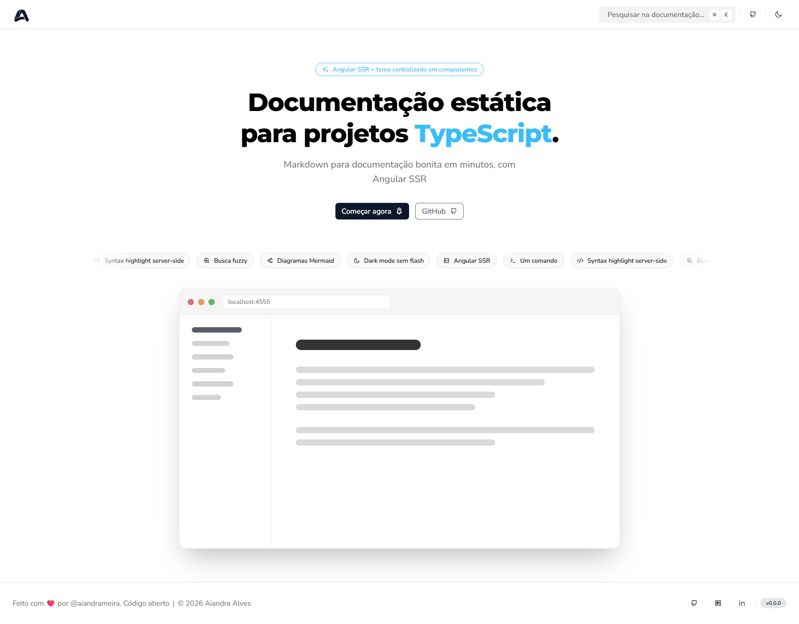

# AiDocs

<p align="center">
    
</p>

<p align="center">
    <strong>Crie sites de documentação estáticos a partir de arquivos Markdown.</strong><br />
    Busca, dark mode, syntax highlight e diagramas Mermaid sem precisar montar um frontend.
</p>

<p align="center">
    <a href="https://www.npmjs.com/package/@aiandralves/ai-docs"></a>
    <a href="https://www.npmjs.com/package/@aiandralves/ai-docs"></a>
    
    <a href="./LICENSE.md"></a>
</p>

<p align="center">
    
</p>

## Sobre

O AiDocs transforma uma pasta de arquivos `.md` em um site de documentação estático, pronto para hospedar no GitHub Pages, Netlify, Vercel ou em qualquer serviço capaz de publicar arquivos estáticos.

- Inicialização rápida com `ai-docs init`
- Servidor local com atualização automática
- Busca integrada com atalho `Ctrl+K` ou `⌘K`
- Dark mode e syntax highlight
- Diagramas Mermaid no Markdown
- Navegação, sumário e links entre páginas gerados automaticamente
- Saída estática, sem servidor de aplicação em produção

O Angular é usado internamente pelo gerador. O projeto que consome o pacote não precisa usar Angular.

## Comece agora

Requisitos: Node.js 20 ou superior e npm 10 ou superior.

```bash
npm install --save-dev @aiandralves/ai-docs
npx ai-docs init
```

Adicione os comandos ao `package.json`:

```json
{
    "scripts": {
        "docs:dev": "ai-docs dev",
        "docs:build": "ai-docs build"
    }
}
```

Inicie o ambiente local:

```bash
npm run docs:dev
```

Depois, abra `http://localhost:4000`. Para gerar os arquivos de produção, execute:

```bash
npm run docs:build
```

O diretório final é definido pela propriedade `output` do arquivo `ai-docs.config.ts`.

## Configuração básica

O comando `init` cria a pasta `docs/`, uma página inicial e o arquivo `ai-docs.config.ts`:

```ts
import { defineConfig } from "@aiandralves/ai-docs/config";

export default defineConfig({
    title: "Minha documentação",
    description: "Guias e referência do meu projeto.",
    docs: "./docs",
    output: "./dist/docs",
    base: "/",
    features: {
        search: true,
        darkMode: true,
        copyCode: true,
        mermaid: true,
    },
});
```

Cada arquivo Markdown dentro de `docs/` se torna uma página:

```text
docs/
├── index.md
├── instalacao.md
└── api/
    └── referencia.md
```

Consulte os guias em [`docs/`](./docs) para conhecer a configuração, os recursos e as opções de deploy.

## Desenvolvimento do projeto

Instale as dependências e inicie a aplicação de demonstração:

```bash
npm ci
npm run dev
```

Comandos principais:

| Comando               | Descrição                                           |
| --------------------- | --------------------------------------------------- |
| `npm run dev`         | Inicia a aplicação de demonstração                  |
| `npm run build`       | Compila a aplicação                                 |
| `npm run docs:dev`    | Executa localmente a documentação deste repositório |
| `npm run docs:build`  | Gera a documentação estática                        |
| `npm run cli:build`   | Gera o pacote completo em `dist/libs/ai-docs`       |
| `npm run cli:publish` | Gera e publica o pacote no npm público               |

Antes de publicar, autentique-se com `npm login` e confirme que possui acesso ao escopo `@aiandralves`.

## Tecnologias

[Angular](https://angular.dev), [Nx](https://nx.dev), [Tailwind CSS](https://tailwindcss.com), [markdown-it](https://github.com/markdown-it/markdown-it), [Shiki](https://shiki.style), [Fuse.js](https://www.fusejs.io), [Mermaid](https://mermaid.js.org), [Commander.js](https://github.com/tj/commander.js) e [Zod](https://zod.dev).

## Licença

Distribuído sob a licença MIT. Consulte [`LICENSE.md`](./LICENSE.md).
