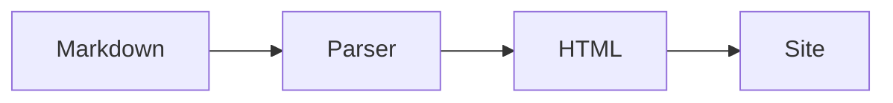

# Guia passo a passo

Este guia cobre o fluxo completo: criar a configuração, escrever páginas, visualizar localmente e gerar o build final.

## 1. Inicializar o projeto

Em um projeto TypeScript existente, rode:

```bash
npx @aiandrameira/ai-docs init
```

Isso cria:
- `ai-docs.config.ts` com as opções principais
- `docs/index.md` como página inicial

## 2. Configurar o título e a descrição

Abra `ai-docs.config.ts` e ajuste:

```ts
export default defineConfig({
  title: 'Minha Lib',
  description: 'Documentação da minha biblioteca TypeScript.',
  docs: './docs',
  output: './dist/docs',
  base: '/',
});
```

## 3. Criar as páginas

Cada arquivo `.md` dentro de `docs/` vira uma página. A estrutura de pastas define a hierarquia da sidebar:

```
docs/
├── index.md           → /
├── instalacao.md      → /instalacao
├── api/
│   ├── index.md       → /api
│   └── metodos.md     → /api/metodos
└── exemplos.md        → /exemplos
```

Use o frontmatter para definir título e ordem:

```yaml
---
title: Instalação
order: 2
---

# Instalação

Conteúdo da página...
```

## 4. Visualizar localmente

```bash
npm run docs:dev
```

O servidor inicia em [http://localhost:4555](http://localhost:4555) com hot reload — ao salvar um `.md`, a página atualiza automaticamente.

## 5. Adicionar diagramas Mermaid

Habilite o suporte no config:

```ts
features: { mermaid: true }
```

Então use blocos de código com a linguagem `mermaid`:

````md

````

## 6. Ativar busca

```ts
features: { search: true }
```

A busca indexa títulos e conteúdo de todas as páginas automaticamente. O atalho ⌘K (ou Ctrl+K) abre a paleta de comandos.

## 7. Gerar o build

```bash
npm run docs:build
```

A pasta de saída (padrão `./dist/docs`) contém HTML estático pronto para deploy. Não requer servidor — qualquer CDN ou hospedagem estática funciona.

## 8. Deploy

### GitHub Pages

Adicione um workflow `.github/workflows/docs.yml`:

```yaml
name: Deploy Docs
on:
  push:
    branches: [main]
jobs:
  build:
    runs-on: ubuntu-latest
    steps:
      - uses: actions/checkout@v4
      - uses: actions/setup-node@v4
        with:
          node-version: 20
      - run: npm ci
      - run: npm run docs:build
      - uses: peaceiris/actions-gh-pages@v4
        with:
          github_token: ${{ secrets.GITHUB_TOKEN }}
          publish_dir: ./dist/docs
```

### Vercel / Netlify

Aponte o diretório de build para `dist/docs` e o comando para `npm run docs:build`. Nenhuma configuração adicional necessária.
