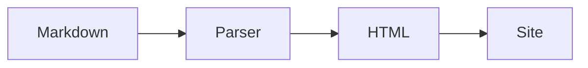

# Recursos do Markdown

Além do Markdown padrão, o AiDocs adiciona alguns recursos extras — direto nos arquivos `.md`, sem nenhuma configuração adicional.

## Blocos de código

Blocos ` ``` ` recebem highlight via Shiki (tema claro/escuro automático) e um botão de copiar no canto superior direito.

```ts
export function ola(nome: string): string {
    return `Olá, ${nome}!`;
}
```

O botão de copiar pode ser desativado globalmente com `features.copyCode: false` — veja [Configuração](/config).

## Diagramas Mermaid

Use um bloco de código com a linguagem `mermaid`:

````md

````

O resultado é um diagrama interativo:


- **Zoom** com os botões no canto superior direito do diagrama.
- **Arraste** o diagrama com o mouse para mover para os lados (também funciona por toque).
- Diagramas maiores que o container ganham uma barra de rolagem horizontal.

Precisa habilitar `features.mermaid: true` no `ai-docs.config.ts` — veja [Configuração](/config).

## Avisos (callouts)

Cinco variações, para destacar informações importantes no texto:

```md
::: primary
Mensagem em destaque neutro.
:::

::: info
Informação adicional.
:::

::: success
Algo deu certo.
:::

::: warning
Atenção com isso.
:::

::: destructive
Cuidado, ação irreversível.
:::
```

Resultado:

::: primary
Mensagem em destaque neutro.
:::

::: info
Informação adicional.
:::

::: success
Algo deu certo.
:::

::: warning
Atenção com isso.
:::

::: destructive
Cuidado, ação irreversível.
:::

Também aceitam um título opcional na mesma linha de abertura:

```md
::: warning Cuidado
Essa operação não pode ser desfeita.
:::
```

::: warning Cuidado
Essa operação não pode ser desfeita.
:::

## Badges

```md
::badge[Novo]
```

Resultado: ::badge[Novo]

## Método HTTP

Útil para documentar endpoints de API:

```md
::http-method[GET] `/usuarios`

::http-method[POST] `/usuarios`

::http-method[PUT] `/usuarios/:id`

::http-method[DELETE] `/usuarios/:id`
```

Resultado:

::http-method[GET] `/usuarios`

::http-method[POST] `/usuarios`

::http-method[PUT] `/usuarios/:id`

::http-method[DELETE] `/usuarios/:id`

## Ícones de seta

Emojis de seta e combinações de teclado viram ícones automaticamente, tanto no texto quanto em tabelas:

```md
⬅️ ➡️ ⬆️ ⬇️ ↗️ ↘️ ↙️ ↖️

A -> B, C <- D, E => F, G <= H, I <-> J
```

Resultado:

⬅️ ➡️ ⬆️ ⬇️ ↗️ ↘️ ↙️ ↖️

A -> B, C <- D, E => F, G <= H, I <-> J

Combinações reconhecidas: `->`, `<-`, `=>`, `<=`, `<->`, `<=>`, `-->`. Um `>` ou `<` sozinho (blockquote, comparações) não é afetado, e nada dentro de blocos de código é convertido.

## Frontmatter

Cada página aceita opções de exibição via frontmatter (`sidebar`, `toc`, `breadcrumb`, `draft`, `order`...) — veja a seção [Frontmatter em Configuração](/config#frontmatter).
