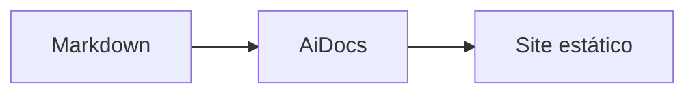

# @aiandralves/ai-docs

<p align="center">
  
</p>

<p align="center">
    <strong>Gere um site de documentação estático a partir de Markdown.</strong><br />
    Pronto para projetos TypeScript, com busca, dark mode, syntax highlight e Mermaid.
</p>

<p align="center">
    <a href="https://www.npmjs.com/package/@aiandralves/ai-docs"></a>
    <a href="https://www.npmjs.com/package/@aiandralves/ai-docs"></a>
    
</p>

<p align="center">
    
</p>

## Instalação

Requer Node.js 20 ou superior.

```bash
npm install --save-dev @aiandralves/ai-docs
```

O pacote está disponível no npm público. Não é necessário configurar um registry privado nem usar um token do GitHub.

## Início rápido

Inicialize a documentação no diretório atual:

```bash
npx ai-docs init
```

Esse comando cria:

```text
seu-projeto/
├── ai-docs.config.ts
└── docs/
    └── index.md
```

Adicione os scripts:

```json
{
    "scripts": {
        "docs:dev": "ai-docs dev",
        "docs:build": "ai-docs build"
    }
}
```

Inicie o servidor local:

```bash
npm run docs:dev
```

Acesse `http://localhost:4000`. Para escolher outra porta, use `ai-docs dev --port 3000`.

Gere o site para produção:

```bash
npm run docs:build
```

O resultado é um conjunto de arquivos estáticos no diretório configurado em `output`, pronto para deploy.

## Configuração

Edite `ai-docs.config.ts`:

```ts
import { defineConfig } from "@aiandralves/ai-docs/config";

export default defineConfig({
    title: "Minha biblioteca",
    description: "Documentação oficial da minha biblioteca.",
    docs: "./docs",
    output: "./dist/docs",
    base: "/",
    logo: "/assets/logo.svg",
    github: "https://github.com/usuario/projeto",
    features: {
        search: true,
        darkMode: true,
        copyCode: true,
        mermaid: true,
    },
});
```

Opções mais usadas:

| Opção              | Descrição                                                |
| ------------------ | -------------------------------------------------------- |
| `title`            | Nome exibido no site                                     |
| `description`      | Descrição padrão para metadados                          |
| `docs`             | Diretório dos arquivos Markdown                          |
| `output`           | Diretório dos arquivos gerados                           |
| `base`             | Caminho base do deploy, como `/meu-repo/`                |
| `logo` e `favicon` | Identidade visual do site                                |
| `github`           | Link do repositório exibido no cabeçalho                 |
| `nav`              | Links adicionais de navegação                            |
| `theme.customCss`  | Arquivo CSS adicional                                    |
| `features`         | Busca, tema, cópia de código, Mermaid e edição no GitHub |

## Criando páginas

Todo arquivo `.md` dentro do diretório `docs` vira uma página. Pastas criam grupos de navegação.

```md
---
title: Instalação
description: Como instalar o projeto.
order: 2
---

# Instalação

Conteúdo da página.
```

O frontmatter também aceita `draft`, `sidebar`, `toc` e `breadcrumb`.

Para criar um diagrama, habilite `features.mermaid` e use:

````md

````

## CLI

| Comando                             | Descrição                                          |
| ----------------------------------- | -------------------------------------------------- |
| `ai-docs init [diretório]`          | Cria a configuração e os arquivos iniciais         |
| `ai-docs dev`                       | Inicia o servidor local com atualização automática |
| `ai-docs build`                     | Gera o site estático                               |
| `ai-docs dev --port 3000`           | Inicia o servidor em outra porta                   |
| `ai-docs build --config caminho.ts` | Usa outro arquivo de configuração                  |

## Deploy

Publique o diretório definido em `output` em qualquer hospedagem estática. Em deploys sob um subdiretório, como GitHub Pages, ajuste `base`:

```ts
export default defineConfig({
    // ...
    output: "./dist/docs",
    base: "/nome-do-repositorio/",
});
```

## Links

- [Código-fonte e issues](https://github.com/aiandrameira/ai-docs)
- [Pacote no npm](https://www.npmjs.com/package/@aiandralves/ai-docs)
- [Documentação no repositório](https://github.com/aiandrameira/ai-docs/tree/main/docs)

## Licença

MIT © Aiandra Alves
